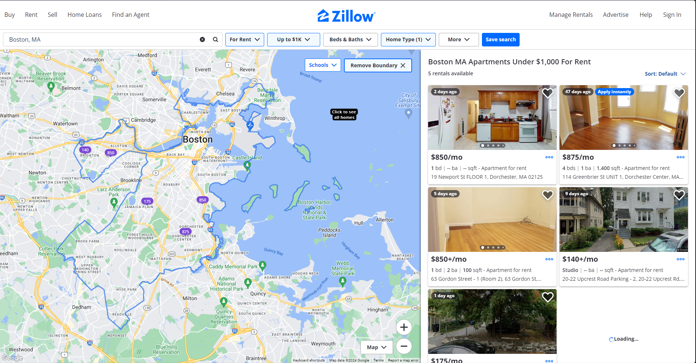

# Assignment 2 - Divergent Design

## **Broad Application Goals**

**Name:** PumpUp

**Audience:** gym-goers of all levels, especially for beginners

**Value:** PumpUp will provide a community for gym-goers of all levels, leveraging social media to let users share their workouts and learn from others. Unlike existing social media gym apps, with PumpUp, users can ask questions anonymously and receive gym-related help from others, watch videos of other people showing how they do specific exercises, and connect with other gym-goers for mentorship and support, which is especially useful for beginners and others seeking companionship in the gym.

## Scrapbook of Comparables

{:width='700'}
Hevy Home Feed for workouts from you and people you follow. Could implement similar feature where workouts that might interest the user show up on their feed.

{:width='700'}
Hevy workouts page where users can create workouts with preset exercises and custom exercises. Could implement similar feature to let users customize their workouts and help maintain a consistent workout routine.

{:width='700'}
Hevy page for each exercise that shows your history and a video demonstration of how to do it. Could implement similar feature with videos of users sharing how they like to do the exercise.

{:width='700'}
Hevy Statistics and Calendar that show progress. Could implement similar features to show progress and incentive users to continue making progress.

{:width='200'}
Sweatcoin currency that users earn from taking steps. Could implement similar feature to incentivize users to hit their goals in the gym.

{:width='700'}
Zillow home finding feature. Could implement similar feature for users to find nearby gyms when they’re traveling/moving to a new location or when they want to find a new gym.

{:width='700'}
Snapchat map showing friends and hotspots of public snaps that can be viewed. Could implement similar feature to see where gym friends are and also what is happening at nearby gyms.

{:width='700'}
Reddit subreddits that let people post and view stuff about a specific topic. Could implement similar feature for users to post and learn stuff on specific gym exercises/concepts.

{:width='700'}
Tinder partner matching. Could implement similar feature for users to connect with nearby compatible gym-goers.

{:width='700'}
Hush feature that lets you join Groups anonymously. Could implement similar feature to ask/share anonymously so that users do not have to worry about being judged.

## Brainstorming Feature Ideas

1. **Feed:** On the home page of the app, users see their feed, which is a mix of workout sessions from people on their following list and people that they might be interested in as determined by some algorithm. It will be split into two sections—For You and Following—so that users can easily switch between browsing interesting content and keeping up with their friends.
2. **Workouts:** The Workouts page will let users create workouts and folders to organize and plan their workout routines. Each workout will contain exercises with sets and rest times between sets. Each exercise is either already added to the app or created by the user if the specific exercise does not exist.
3. **Exercise Info:** When a user clicks on an exercise that the app already has, they will be brought to a page that describes that exercise with step-by-step instructions, as well as videos from people who shared how they performed that exercise. It will also show progress charts, which can be changed by switching the y-axis variable between volume, reps, duration, and other measurements.
4. **Stories**: Users can share stories rather than a post of their workouts with photos, exercises, and personal notes, similar to Instagram stories but tailored to fitness progress.
5. **Progress Timelines**: Users can track and visualize their fitness journey over time with timelines that showcase achievements, body measurements, and progress photos.
6. **Leaderboards**: A competitive feature that allows users to challenge their friends or the community with specific stats (e.g., heaviest bench press, most workouts done this year).
7. **Expert Live Streams**: Fitness experts and trusted influencers can host live workout sessions, Q\&A sessions, or health discussions, with users having the option to interact in real-time. Users can comment on the livestream for others and the livestreamer to see and react to.
8. **Personal Best Tracker**: As users log their workouts, the app will keep track of their personal bests and alert them with a notification and rewards when they hit a new personal best.
9. **Supplement and Diet Recommendations**: Based on users’ goals (e.g., muscle gain, fat loss), the app provides personalized nutrition and supplement suggestions.
10. **Goal-based Workout Groups**: Users can join groups based on specific fitness goals, like weight loss, bodybuilding, or marathon training, and share progress with others working toward similar objectives.
11. **Matching**: A feature that connects users with other users nearby with similar interests so that they can plan workouts together. Users can swipe left or right on potential matches—similar to Tinder—and text people they match with.
12. **Challenges**: App-generated fitness challenges that users can participate in, earning rewards for completion. These include daily, weekly, yearly, and special event challenges.
13. **Dynamic App Logo:** Similar to Duolingo, PumpUp can change its app logo to motivate users when they haven’t logged a workout in a while.
14. **Marketplace**: A marketplace where users can buy and sell gym gear, supplements, or fitness-related products. Users can also rate and endorse products so that other people can have more information about the products.
15. **Workout Syncing**: Sync data from fitness trackers like the Apple Watch to automatically log workouts, heart rate, and other fitness metrics.
16. **Communities**: A community is similar to a subReddit where users can chat about a specific topic. Users can subscribe to communities that they are interested in and post anonymously.
17. **Events**: Users can create or join local fitness events, from marathons to group workout sessions.
18. **Map:** The map will share public content from hotspots and also have information about nearby gyms and other fitness facilities.
19. **Mental Wellness**: A section dedicated to mental well-being, with guided meditations, breathing exercises, and motivational talks tailored for gym-goers to maintain mental health alongside physical fitness.
20. **Recovery Recommendations**: Based on logged workouts, the app suggests personalized recovery routines (e.g., stretching, yoga, or foam rolling) and offers tips for post-workout nutrition and sleep optimization.
21. **Music**: A built-in feature where users can listen to workout playlists tailored to different exercises, like running, weightlifting, or yoga.

## VSD Analysis

### Stakeholders \- Encouraging Inclusivity in Fitness Goals

1. **Stakeholders \- Beginners and Misinformation**
   - _Observation_: Beginners might rely heavily on features like Supplement and Diet Recommendations, which, could expose them to misinformation or harmful advice.
   - _Design Response_: Introduce a verification system for fitness experts and nutrition advice, ensuring only accredited professionals can contribute to sensitive areas like diet and supplementation. Additionally, provide educational resources to allow beginners to question and verify the advice they receive.
2. **Stakeholders \- Encouraging Inclusivity in Fitness Goals**
   - _Observation_: The **Goal-based Workout Groups** may unintentionally favor specific fitness goals (e.g., bodybuilding or weight loss) while excluding or overlooking niche fitness needs like rehab exercises or adaptive fitness for people with disabilities.
   - _Design Response_: Add diverse group categories, ensuring all users, regardless of their fitness background, can find a community. Include specific accessibility options to promote a sense of belonging for all fitness levels and needs.
3. **Time \- Long-term Community Dynamics**
   - _Observation_: Over time, the **Leaderboards** could create unhealthy competition and foster toxic behavior, leading some users to feel inadequate if they can’t keep up.
   - _Design Response_: Implement moderation tools to filter aggressive or harmful comments and ensure challenges emphasize personal growth and improvement over competition. Add "compassionate challenge modes" that focus on collaboration rather than rivalry.
4. **Pervasiveness \- Influence of Fitness Influencers on Community Culture**
   - _Observation_: The **Stories** and **Feed** features might lead to an unrealistic portrayal of fitness journeys, where influencers showcase rapid, highly visual transformations, creating pressure for users to prioritize appearance over health.
   - _Design Response_: Introduce guidelines for sharing transformations that emphasize health metrics alongside visual changes. Offer an option for users to share non-visual success stories, promoting a broader, healthier view of fitness progress.
5. **Value \- Autonomy**
   - _Observation_: Users should feel empowered to make their own fitness decisions, free from overwhelming expert influence or community pressure. Features like **Supplement and Diet Recommendations** may undermine user autonomy by steering them toward specific behaviors or products.
   - _Design Response_: Ensure all recommendations come with multiple options and emphasize that users can opt-out of receiving advice entirely. Include educational content so users can make informed decisions on their own.

## Storyboarding and Sketching

### Logging A Saved Workout

{:width='700'}

### Asking Questions on a Community

{:width='700'}
