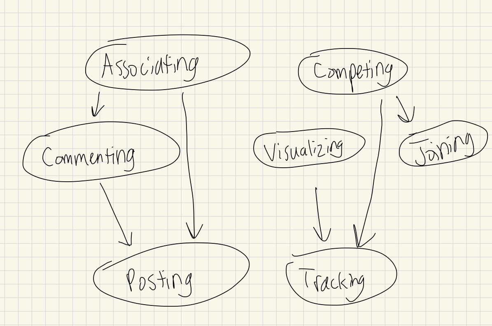

# Assignment 3 - Convergent Design

## Pitch

PumpUp is a gym social media that will provide a community for gym-goers of all levels, leveraging social media to let users share their workouts and learn from others. Unlike existing social media gym apps, with PumpUp, users can act anonymously, join specific communities that they are interested in, and participate in competitions. The anonymity aspect is especially useful for beginners like Emily (one of the interviewees) who don’t want to identify themselves but want to receive help and use the app to its fullest potential. The communities are based on subReddits, which prompt discussion on specific topics so that users can find communities that they are interested in and compartmentalize their content. This can be useful for users like John (the other interviewee) who want to see videos of specific exercises since they can join communities for specific exercises. Finally, competitions are a good incentive for gym-goers of all levels to continue hitting their goals and combined with anonymity, allows users—especially beginners—to join competitions without fear of being judged. Overall, PumpUp is a safe space for gym-goers of all levels to connect, learn, and teach.

## Functional Design (Concepts)

### Posting \[Content\]

**Purpose**

Allow users to publish posts that other users can view and interact with

**Operational Principle**

After publishing a post _p_ with content _c_, other users can view _c_ and interact with _p_.

**State**

```
userPosts: User → set Post
content: Post → one Content
interactions: Post → set Interaction
```

**Actions**

```
publish (user: User, content: Content, out post: Post)
    post not in user.userPosts
    user.userPosts += post
    post.content := content
    post.interactions := none

view (post: Post, out content: Content)
	content := post.content

interact (post: Post, interaction: Interaction)
	post.interactions += interaction
```

### Commenting \[Item, Content\]

**Purpose**

Allow users to add comments to items

**Operational Principle**

After viewing an item _i_, users can submit a comment _c_ in response to _i_. _c_ now becomes visible to others.

**State**

```
itemComments: Item → set Comment
userComments: User → set Comment
content: Comment → one Content
```

**Actions**

```
publish (user: User, item: Item, content: Content, out comment: Comment)
	comment.content := content
	user.userComments := comment
	item.itemComments += comment

viewComments (item: Item, out comments: set Comment)
	comments := item.itemComments
```

### Associating \[Item\]

**Purpose**

Allow users to associate themselves with items or choose not to

**Operational Principle**

When a user _u_ does an action that produces item _i_, _u_ can choose to associate themselves to _i_ or not to and remain anonymous.

**State**

```
owner: Item → User
```

**Actions**

```
associate (user: User, out item: Item)
	item.owner := user
```

### Joining \[Group\]

**Purpose**

Allow users to join groups

**Operational Principle**

Users join a group _g_ to follow more closely and interact more with that group.

**State**

```
members: Group → set User
```

**Actions**

```
join (user: User, group: Group)
	user not in group.members
	group.members := user
```

### Tracking \[Data\]

**Purpose**

Allow users to track data over time

**Operational Principle**

User _u_ tracks their data _x_ on Date _d_.

**State**

```
userData: User → Data
date: Data → Date
```

**Actions**

```
logData (user: User, data: Data, date: Date)
	data.date := date
	user.userData := data
```

### Visualizing \[Data\]

**Purpose**

Allow users to visualize data in an intuitive way

**Operational Principle**

After tracking data _d_, user _u_ can view visualizations of _d_ to better understand _d_.

**State**

```
data: Visualization → Data
```

**Actions**

```
generate (data: Data, out visualization: Visualization)
	visualization.data := data
```

### Competing

**Purpose**

Allow users to compete with other users

**Operational Principle**

User _u_ joins a competition _c_ and their performance is ranked against others based on _u_’s score _s_.

**State**

```
activeCompetitions: set Competition
endDate: Competition → one Date
competitorData: User → set Data
score: Data → one Number
```

**Actions**

```
createCompetition (competition: Competition)
	competition not in activeCompetitions
	activeCompetitions += competition

updateScore (user: User, competition: Competition, data: Data, out score: Number)
	competition in activeCompetitions
	user.competitorData += data
	score := data.score

system endCompetition (competition: Competition)
	competition in activeCompetitions
	competition.endDate is before now
	activeCompetitions -= competition
```

## Functional Design (Synchronizations)

```
concept PostingVideo
	include Posting [Video]
	include Associating [Video]

	sync post (user: User, video: Video, anonymous: Boolean, out post: Post)
		Posting.publish (user, video)
		if not anonymous
		Associating.associate (user, post)

concept CommentingTextOnPost
	include Commenting [Post, String]
	include Associating [String]

	sync comment (user: User, post: Post, text: String, anonymous: Boolean, out comment: Comment)
		Commenting.publish (user, post, text, comment)
		if not anonymous
		Associating.associate (user, post)1

concept joiningCommunity
	include Joining [Community]

	join (user: User, community: Community)
		Joining.join(user, community)

concept ParticipatingInCompetition
	include Joining [Competition]
	include Tracking [WorkoutData]
	include Visualizing [WorkoutData]
	include Competing
	include Associating [WorkoutData]

	sync joinCompetition (user: User, competition: Competition)
		Joining.join (user, competition)

	sync logWorkout (user: User, competition: Competition, workoutData: WorkoutData, date: Date, anonymous: Boolean, out workoutProgress: Graph, out score: Number)
		Tracking.logData (user, workoutData, date)
		Visualizing.generate (workoutData, workoutProgress)
		Competing.updateScore(user, workoutData, score)
		if not anonymous
		Associating.associate(user, workoutData)
```

## Functional Design (Dependency Diagram)

{:width='700'}

## Wireframes

[Figma Link](https://www.figma.com/design/1PNSSi5zt7aZA9c0tNTYsf/6.1040-A3?node-id=0-1&t=KTNeyh9LcHzDH9PM-1)

## Design Tradeoffs

### Doing Things Anonymously

**Options**

1. Forcing users to publish their name with anything they do
2. Making everything anonymous
3. Letting users choose if they want to remain anonymous or not

**Result**

I went with the third option because it allows for a lot of flexibility and accounts for all types of users: those who don’t care about anonymity, those who want to stay completely anonymous, and those somewhere in between. It can avoid a lot of issues arising from judgment and bullying while still providing a sense of community since there are some known users to interact with.

### What Users Are Able To Comment On

**Options**

1. Let users only comment on posts
2. Let users only comment on posts and comments that comment on post
3. Let users comment on any comment or post

**Result**

I went with the third option because I believe in flexibility and letting users take advantage of the comment feature to indicate that they are commenting on something specific, which may be a nested comment. This design decision works well in Reddit so I believe it will work well in PumpUp as well.

### Content That Users See On Their Feed

**Options**

1. A feed based on activity
2. A feed based on subscription

**Result**

I went with the first option because I also allow for the joining of communities/competitions that users will be able to find in another tab. The feed can then be used as a way for users to explore new content that they might turn out to like.
