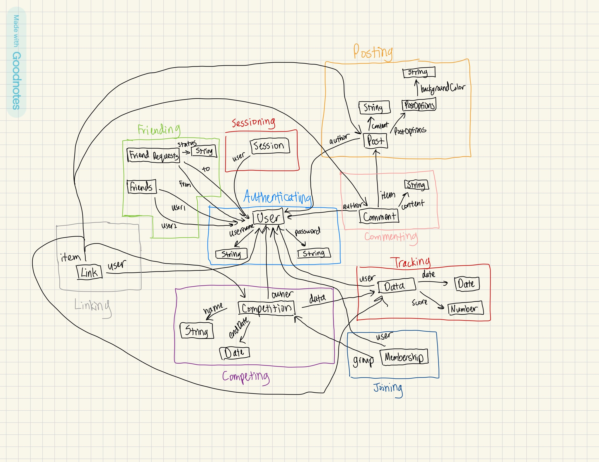

# Assignment 4 - Backend Design & Implementation (Beta)

## Concepts

### **Authenticating**

```
username: User → one String
password: User → one String
```

### **Sessioning \[User\]**

```
user: Session → User
```

### **Friending \[User\]**

```
friends: User → set User
friendRequests: User → set User
status: friendRequests → one String
```

### **Posting \[Author\]**

```
author: Post → one Author
content: Post → one String
options: Post → one PostOptions → one String
```

### **Commenting \[Item, Author\]**

```
author: Comment → one Author
item: Comment → one Item
content: Comment → one String
```

### **Tracking \[User\]**

```
user: Data → one User
date: Data → one Date
score: Data → one Number
```

### **Competing \[User\]**

```
name: Competition → one String
owner: Competition → one User
endDate: Competition → one Date
data: Competition → set Data
```

### **Joining \[User, Group\]**

```
membership: User → set Group
```

### **Linking \[User, Item\]**

```
links: User → set Item
```

## **App**

```
app PumpUp

type Item = Posting.Post | Commenting.Comment | Tracking.Data | Competing.Competition

concepts
  Authentiating
  Sessioning [Authentiating.User]
  Friending [Authentiating.User]
  Posting [Authentiating.User]
  Commenting [Posting.Post, Authenticating.User]
  Tracking [Authenticating.User]
  Competing [Authenticating.User]
  Joining [Authenticating.User, Competing.Competitions]
  Linking [Authenticating.User, Item]
```

## Data Model Diagram

{:width='700'}

## Design Reflections

### Removing Visualizing

I originally had a Visualizing concept to enable synchronizations with my Tracking concept that enables users to track their data. However, after trying to implement it, I realized there was nothing substantial to implement on the backend because a visualization is just a representation of data, which is a type that Tracking creates. The visualization generation is a job for the frontend. On the backend, there could be a use of a similar concept Combining that holds sets of Tracking.Data so that users can store visualization datasets, but I think for the scale of my app, I will only display simple visualizations with one data.

### Missing Concept Functionality

In my A3, I had some concepts that only had little functionality. I wasn’t able to fully realize the functionality necessary for my app until I started implementing the backend. For example, many of my concepts did not have observer methods that allowed for synchronizations to use. After implementing the backend, I ended up with lots of functionality for each concept that allowed for many synchronizations to create a fully-functional app.

### Realizing Linking’s Functionality

Firstly, since my A3, I renamed Associating to Linking to create more meaningful names for related resources (LinkDoc instead of AssociationDoc). My vision for Linking is to allow for anonymity/publicity. In my A3, since I had missing functionality, I only allowed for the creation of links and nothing depended on these links. However, after implementing the backend, I took full advantage of Linking’s purpose to redact author/owner information from items they don’t link to when returning items . Also, I only returned linked items when searching for items by username. This allowed for actual anonymity when displaying items or searching for items by user.
