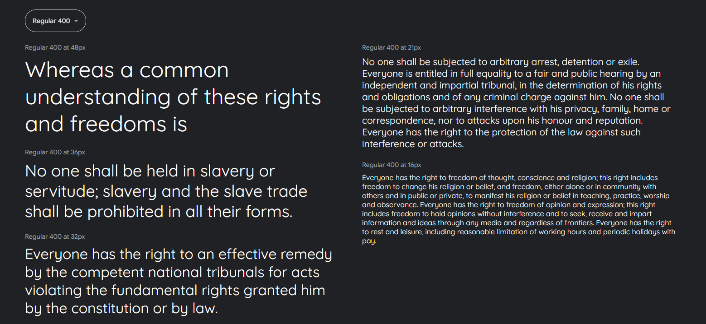

# **Assignment 5 - Frontend Design & Implementation (Beta)**

## Links

[Deployment](https://pump-up.vercel.app/)

[Repo](https://github.com/brianzheng205/PumpUp)

## Heuristic Evaluation

### Usability — Discoverability

- _Observation:_ PumpUp has a very intuitive UI similar to many social media apps, which will allow new users to quickly learn how to use it.
- _Improvement:_ The logging data experience is likely to be unfamiliar to many so I can make sure to label options and make actions as obvious as possible.
- _Tradeoff_: This will sacrifice some pleasantness since the UI will be more cluttered.

### Usability — Efficiency

- _Observation:_ For looking through past data, there is no searching UI in the wireframe, meaning users have to scroll down their entire history to see old data.
- _Improvement:_ I will add some search functionality such as searching by date or date range to help users quickly find the data they want.
- _Tradeoff_: This might sacrifice some discoverability since new users might be confused about how to use the searching UI.

### Physical — Fitt’s Law

- _Observation:_ The navigation bar is always at the bottom of the app, allowing users to quickly navigate through different pages of the app. However, since this is a web-based app that computer users will use, taking up the entire width of the screen will spread the different icons out very far.
- _Improvement:_ I will move the navigation bar to the left hand side and stack the different icons on top of each other without spreading it down the whole height. This will bring the icons much closer together and much closer to the search bar on the searching page.

### Physical — Situational Context

- _Observation:_ On the navigation bar, the icon corresponding to the user’s current page is blue rather than white to indicate to the user where they currently are on the app. Since I am exploring moving the navigation bar to the left side, I will most likely add text for each icon.
- _Improvement:_ Highlighting the whole row rather than just turning the icon blue will make it more obvious where the user is on the app.

### Linguistic — Speak a User’s Language

- _Observation:_ When posting or commenting, a popup appears to ask the user if they want to associate themselves to the content, which might not be very clear to the user. I chose this wording because I originally had this concept named as Associating.
- _Improvement:_ I can reword it to ask the user if they want to link themselves to the content so that other users can see that they posted the content.
- _Tradeoff_: This will sacrifice some pleasantness because there will be more text. This will especially affect veteran users who do not read the text because they already understand the action.

### Linguistic — Consistency

- _Observation:_ The UI is very consistent throughout the app because many items such as posts, competitions, and workout data are grouped into rectangles with posts and competitions having a picture at the top left. A rectangle with a blue background indicates a post/competition that belongs to the user, but the user’s workout data is not blue.
- _Improvement:_ I could change the data to have blue backgrounds to clarify that the user owns that data.

## Visual Design Study

### Typography

I looked through Google Fonts to find readible and aesthetic fonts and came across Quicksand.

{:width='700'}

### Color

I explored color palettes on Coolors that were not too bright and strainful on the eyes. I wanted them to be aesthetic as well without being excessively bright.

{:width='700'}
